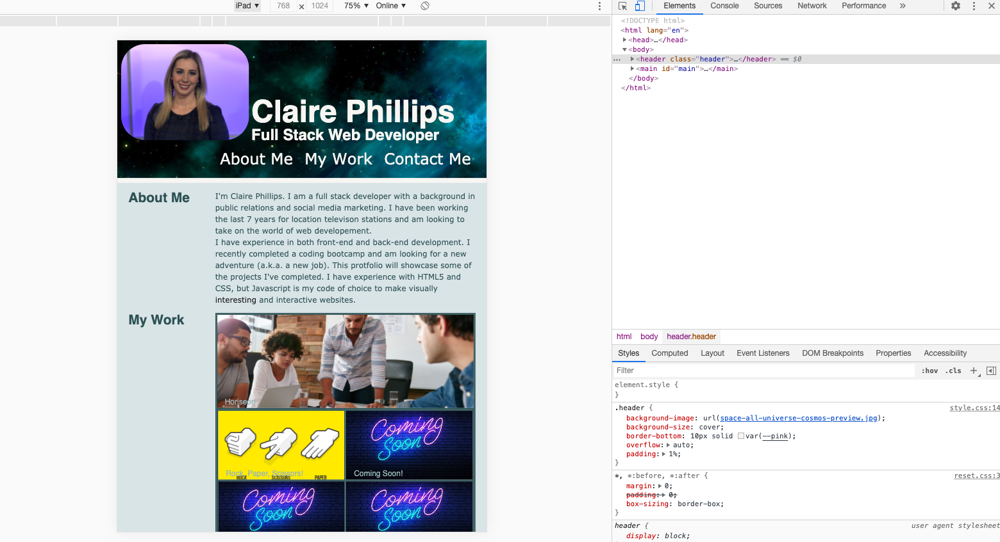

# HW2-CSS-Portfolio

## Claire Phillips: CSS Portfolio

Link: [Claire Phillips Portfolio](https://clairephillips51.github.io/hw2-css-portfolio/)

### Summary

I built a web developer portfolio using semantic html and advanced css styling. Flexbox and media queries were used to support responsive web design.

### Table of contents:

1. [Process](#process)

2. [Features](#features)

3. [What I Learned](#what-i-learned)

4. [Installation](#installation)

5. [Resources](#resources)

### Process
This was a challenging assignment for me. The initial setup of the html code was easy. The one spot I struggled with most was the “my work” section that required multiple `
` elements to support the various flex boxes that would make up that section. 

In the css I knew I needed multiple flexboxes but my problem was how to nest them and how to arrange them. I finally settled on one flex box in `<main>` which I split into two columns. I added a second flexbox which I set up in rows in the `
`s that were within the table element.   

Getting the format of the page to work was an ordeal. Brandon helped me set up the two nested flex boxes. 
From there I added more interactive css styling with minor animations on two spans. 

Psudo classes and elements were also used for hover effects on the “my work” section. I also added some text styling to remove the underline from the links at the top of the page and make the text bigger in the headers. 

### Features

Some major features of my portfolio include the interactive `` elements in the “about me” section. That included some simple animations.
The flexbox containing samples of my work were the most involved elements that included links that take you to the deployed application. They also had hover effects that reduced the opacity by half.

There were also additional links in the “contact me” section that lead to social media links and the “email me” link opened up a form to send me an email.

One thing I forgot to add was a footer. It wasn't listed in the requirements, but I think that is good practice and will make a point to add them going forward. 

### What I Learned

I learned more about flexboxes mostly. Nested flexboxes can be used to create complex structures on a website that are also responsive. 

I also learned how the "viewport" name in the `<meta>` tag was connected to the media queries. Using the dev tools in chrome I looked to see how my website reacted to different views and also checked the website on my phone. There was no horizontal scrolling. 

I also added the :root elements to the css style sheet and used the link that Brandon G. Merritt posted in slack which was great I choosing a color pallete. I picked color pallete number 492.

### Installation

Deploying my portfolio I used gitpages again. To start I created a public repo and then made 3 files: an index.html, reset.css, and style.css.. I added a second branch called "dev" to this repo to practice making and merging different branches. Once the code worked and looked how I wanted I merged my commits from dev into main and pushed  them to github. From there I followed the same steps as the last project. In Github go to settings> options> github pages and set th main branch to be the link to the deployed webpage.

### Resources

I found these links extremely helpful.
* [MDN Using Media Queries](https://developer.mozilla.org/en-US/docs/Web/CSS/Media_Queries/Using_media_queries)
* [Css Media Queries](https://medium.com/@mchisti/two-css-tricks-thatll-make-your-site-fully-responsive-5f9efba4015e)
* [Flexbox Guide](https://css-tricks.com/snippets/css/a-guide-to-flexbox/)
* [HEX color schemes](https://www.instagram.com/p/CH2fYP5gsTw/)
* [HTML Responsive Web Design](https://www.w3schools.com/html/html_responsive.asp)
* [CSS Background Image W3Schools](https://www.w3schools.com/css/css_background_image.asp)

