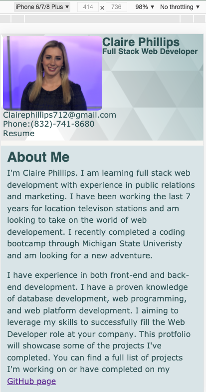

# Claire Phillips: Portfolio

Link: [Claire Phillips Portfolio](https://clairephillips51.github.io/claire-phillips-portfolio/)

### Summary

I built a web developer portfolio using semantic html and advanced css styling along with javascript. Flexbox and media queries were used to support responsive web design.

### Table of contents:

1. [Updates](#updates)

2. [Process](#process)

3. [Features](#features)

4. [What I Learned](#what-i-learned)

5. [Installation](#installation)

6. [Resources](#resources)

### Updates
Many changes were made to my portfolio. I cleaned up the html by having the flexboxes that store my work generated using jQuery. The flexboxes were flipped vertical instead of horizontal and it looks much nicer. The two previous projects and updated homework assignments were added to the My Work section and links to the corresponding Github repos were added below the picture. Media quires were updated to support a better responsive web design. Font awesome was added and used for the social links in the Contact Me section. The header was updated to include my email, phone number and a link to a pdf of my resume. I also customized the wicked cool background in the header at SVGBackgrounds.com to give my portfolio a more minamalist look and it feels much cleaner. 

### Process
The initial setup of the html code was easy. The one spot I struggled with most was the “my work” section that required multiple `
` elements to support the various flex boxes that would make up that section. Using javascript to make the boxes and turning them vertical instead of horizontal made the images fit much better and easier to updates/ work with. 

In the css I knew I needed multiple flexboxes but my problem was how to nest them and how to arrange them. I finally settled on one flex box in `<main>` which I split into two columns one that holds the big picture and the second coloumn is the table that holds the four other projects. The table is also a flex box which I set up in rows. Each individual box is a single element within the table flex box. 

Getting the format of the page to work was an ordeal. Brandon helped me set up the two nested flex boxes. Psudo classes and elements were also used for hover effects on the “my work” section. I also added some text styling to remove the underline from the link at the top of the page and make the text bigger in the header. 

### Features
The flexbox containing samples of my work were the most involved elements that included pictures that are links that take you to the deployed application the text under the pictures are links to the projects or homeworks GitHub repo. They also had hover effects that reduced the opacity by half. My resume is stored as a link in "Full Stack Developer" under my name in the header and I also added an additional link to the my resume under my email and phone number (also in the header). 

There are also additional icons which act as links in the “contact me” section that lead to different social media profiles and the “email me” link opens up a form to send me an email. I also used the title attribute so that my email, phone number will show up when you hover over the icon. 

### What I Learned
I learned more about flexboxes mostly. Nested flexboxes can be used to create complex structures on a website that are also responsive. 

I also learned how the "viewport" name in the `<meta>` tag was connected to the media queries. Using the dev tools in chrome I looked to see how my website reacted to different views and also checked the website on my phone. There was no horizontal scrolling. 

I also added the :root elements to the css style sheet and used the link that Brandon G. Merritt posted in slack which was great I choosing a color pallete. I picked color pallete number 492.

### Installation
Deploying my portfolio I used gitpages. To start I created a public repo and then made 3 files: an index.html, reset.css, and style.css.. I added a second branch called "dev" to this repo to practice making and merging different branches. Once the code worked and looked how I wanted I merged my commits from dev into main and pushed  them to github. From there I followed the same steps as the last project. In Github go to settings> options> github pages and set th main branch to be the link to the deployed webpage.

### Resources
* [MDN Using Media Queries](https://developer.mozilla.org/en-US/docs/Web/CSS/Media_Queries/Using_media_queries)
* [Css Media Queries](https://medium.com/@mchisti/two-css-tricks-thatll-make-your-site-fully-responsive-5f9efba4015e)
* [Flexbox Guide](https://css-tricks.com/snippets/css/a-guide-to-flexbox/)
* [HEX color schemes](https://www.instagram.com/p/CH2fYP5gsTw/)
* [HTML Responsive Web Design](https://www.w3schools.com/html/html_responsive.asp)
* [SVG Background I used](https://www.svgbackgrounds.com/#subtle-prism)
* SVG Fair Use License  

